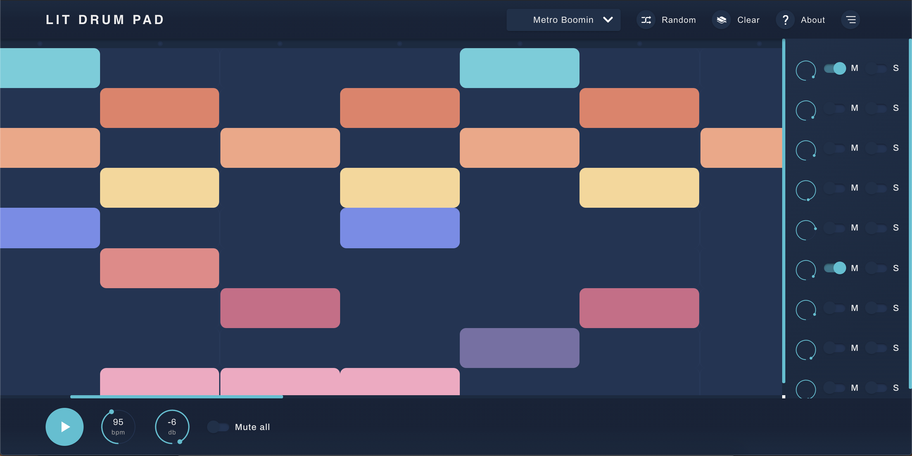

<br />
<p align="center">
  <a href="https://lit-drum-pad.herokuapp.com/">
    
  </a>

  <h3 align="center">Lit Drum Pad</h3>

  <p align="center">
    An application to create catchy rhythms !
    <br />
    <a href="https://lit-drum-pad.herokuapp.com/">View online</a>
  </p>
</p>

<!-- TABLE OF CONTENTS -->

## Table of Contents

- [About the Project](#about-the-project)
  - [Built With](#built-with)
  - [Interface](#interface)
- [Installation](#installation)
- [License](#license)

<!-- ABOUT THE PROJECT -->

### About The Project

Lit drum pad is a web application that lets you create beats via a simple and intuitive interface. Manage each of your tracks by controlling the gain. Adjust the tempo according to your preferences.

Metro boomin, Murda Beatz, Pierre Bourne, Travis Scott… Lit Drum Pad provides you with drum kits from renowned and influential artists and producers.

It's your turn to let your inspiration speak and create acatchy rhythm!

<!-- BUILT WITH -->

#### Built With

- [Vue](https://vuejs.org/)
- [Typescript](https://www.typescriptlang.org/)

<!-- INTERFACE -->

#### Interface

> Lit Drum Pad offers you an intuitive interface



<!-- INSTALLATION -->

### Installation

To setting up the project locally and get a local copy up and running, follow the following steps.

#### Clone the repository

```sh
git clone https://github.com/vscav/lit-drum-machine.git
```

#### Install the dependencies

```
npm install
```

#### Compiles and hot-reloads for development

```
npm run serve
```

#### Compiles and minifies for production

```
npm run build
```

#### Lints and fixes files

```
npm run lint
```

#### Customize configuration

See [Configuration Reference](https://cli.vuejs.org/config/).

### License

Distributed under the MIT License.
